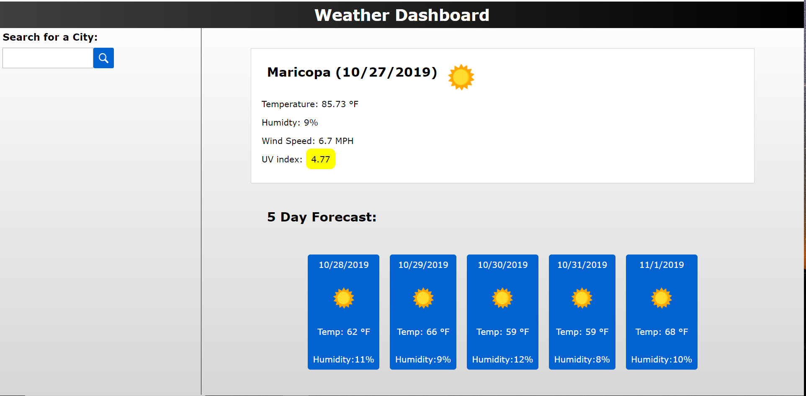

# Weather-Dashboard

The weather dashboard is an interactive web application that lets you get the current weather status for your city. Simply type in the name of a city and the weather will pop up along with the next five day forecast. When the page is loaded the site asks to get your current location. It then proceeds to load the information to the page for your current location. There is a list on the side where all previous searches are stored and they can be clicked on to view the information from your past searches. The past searches are stored in local storage and buttons are rendered to the page when the window loads with the user's past searches. One of the challenging parts of this project was that I had to make three different API calls to get all the data needed to create the weather display. The current weather, UV index, and the five day forecast were all hosted on different endpoints. You can view the final project here: https://aaronangle.github.io/Weather-Dashboard/

